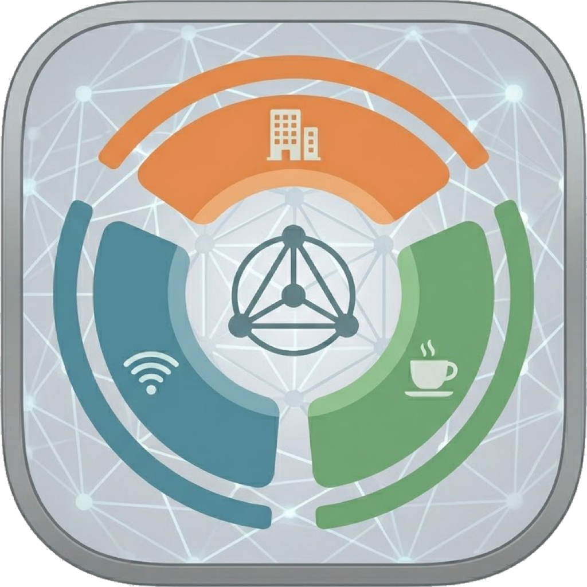
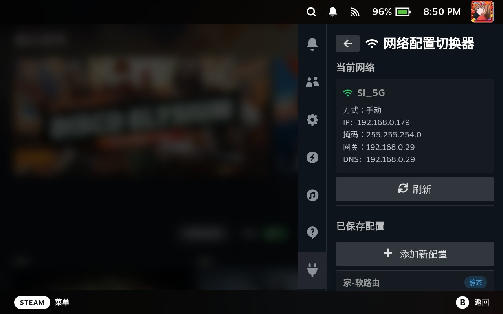

# NetProfile Switcher for Decky

<div align="center">



**A Decky network profile switching plugin for Steam Deck / SteamOS<br/>Save and quickly switch IPv4 static addresses, gateways, DNS, and DHCP modes**

[](LICENSE)
[](https://github.com/SteamDeckHomebrew/decky-loader)
[](https://networkmanager.dev/)
[](https://www.typescriptlang.org/)
[](https://www.python.org/)

**English** | [简体中文](README.md)

</div>

---

## 📖 Introduction

NetProfile Switcher for Decky is a network configuration preset tool designed for Steam Deck's desktop environment. It allows you to save different network configurations (IPv4 address, subnet mask, gateway, and DNS) and switch to a specific configuration with a single tap when needed.

It is ideal for scenarios where you frequently switch between home networks, gaming accelerators, bypass gateways, or environments that require specific DNS settings. You no longer need to repeatedly go into SteamOS system settings to manually modify network parameters — just maintain your presets and apply them with a click.

## 🖼️ Screenshot



## ✨ Features

### 🌐 Network Profile Switching

- **Multi-profile management**: Save profile names, IPv4 addresses, subnet masks, gateways, and DNS.
- **One-tap apply**: Apply any saved configuration directly from the Decky panel.
- **Quick DHCP restore**: Revert the current connection back to DHCP without needing a saved preset.
- **Connection reapply**: Prefers `nmcli device reapply`, falling back to reconnecting the current profile when unavailable.
- **Current connection info**: Read the active Ethernet or Wi-Fi connection. View the current connection name, configuration method, IP address, subnet mask, gateway, and DNS.
- **In-Game Mode operation**: Perform network switching directly from the Decky Quick Access menu.

## 🚀 Quick Start

### System Requirements

- Steam Deck / SteamOS
- Decky Loader

> When applying static IP, gateway, or DNS settings, the current network may briefly disconnect. Make sure your preset parameters are correct, especially in remote debugging or network-dependent scenarios.

### Installation

#### 🛠️ Get from GitHub Releases

Download the latest `.zip` package from [GitHub Releases](https://github.com/sixiaolong1117/NetProfile-Switcher-for-Decky/releases/), transfer it to your Steam Deck, enable Developer Mode in the Decky plugin, and select "Install plugin from ZIP file".

<!-- Click [here](https://github.com/sixiaolong1117/NetProfile-Switcher-for-Decky/releases/latest/download/NetProfile.Switcher.zip) to download the latest version now, or install the latest version via the Decky plugin using the following URL:

```
https://github.com/sixiaolong1117/NetProfile-Switcher-for-Decky/releases/latest/download/NetProfile.Switcher.zip
``` -->

#### 🛠️ Build from Source

1. Clone the repository:

```bash
git clone https://github.com/sixiaolong1117/NetProfile-Switcher-for-Decky.git
cd NetProfile-Switcher-for-Decky
```

2. Install dependencies and build the frontend:

```bash
pnpm install
pnpm run build
```

3. To package the Decky plugin ZIP, prepare the Decky CLI first, then run the build script:

```bash
mkdir -p cli
curl -L -o cli/decky https://github.com/SteamDeckHomebrew/cli/releases/latest/download/decky-linux-x86_64
chmod +x cli/decky
./.vscode/build.sh
```

Build output will be placed in the `out/` directory. The Decky distribution package includes `dist/`, `main.py`, `plugin.json`, `package.json`, `LICENSE`, and README files. You can also run the provided setup and build tasks directly in VS Code / VSCodium.

## 📖 Usage Guide

### ➕ Add a Static Network Profile

1. Open **Network Profile Switcher** from the Decky menu.
2. Click **Add New Profile**.
3. Enter a profile name, e.g., "Home Network" or "Lab Gateway".
4. Select **Manual (Static IP)**.
5. Fill in IP address, subnet mask, gateway, and DNS.
6. Click **Save Profile**.

### 🔁 Switching Profiles

| Action | Description |
|--------|-------------|
| Apply | Apply the selected profile to the current active connection |
| Edit | Modify a saved network preset |
| Delete | Remove an unused network preset |
| Refresh | Re-read the current network status |
| Revert to DHCP | Restore the current connection to DHCP addressing and automatic DNS |

### 🧯 Troubleshooting Apply Failures

When applying fails, the plugin displays error details in the panel:

| Field | Description |
|-------|-------------|
| Action | The step where the failure occurred, e.g., setting IPv4 address or reactivating the connection |
| Exit Code | The return code from the `nmcli` command |
| Details | Error message returned by NetworkManager |
| Command | The `nmcli` command executed by the plugin |

Common causes include: no active network connection, the target connection does not support modification, invalid IP or subnet parameters, NetworkManager refusing to reconnect, or the switched network parameters being unable to reach the current network.

## 🔒 Privacy

NetProfile Switcher for Decky does not collect, upload, or share personal information. The plugin only stores your created network configuration presets locally and modifies the current NetworkManager connection via local `nmcli`.

## 🤝 Contributing

Issues and pull requests are welcome.

## 📄 License

This project is open-sourced under the [BSD 3-Clause License](LICENSE).

## 🙏 Acknowledgments

- [Decky Loader](https://github.com/SteamDeckHomebrew/decky-loader) — Steam Deck plugin loader
- [decky-frontend-lib / @decky/ui](https://github.com/SteamDeckHomebrew/decky-frontend-lib) — Decky plugin frontend component library
